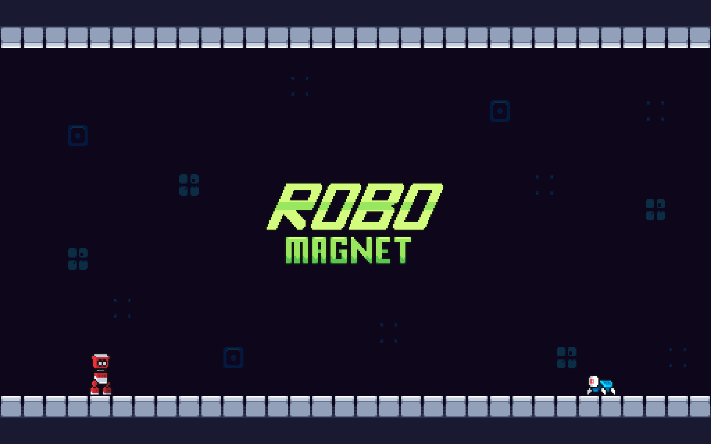

# RoboMagnet
This game is heavily based on RNG and may cause frustration among those who are not patient enough nor fast enough with their keyboards. This game is also not made for the faint-hearted ones. 

Play as the Robo Magnet and move through the levels while you collect batteries to power the doors that will take you to the next level!

Made for the [Weekly Game Jam 134](https://itch.io/jam/weekly-game-jam-134)

The Controls:

- W/A/S/D - Magnet Direction

- Spacebar - Activate Magnet

- Arrow keys - Robot Movement

Credit:

- Programmer: [@bitVivAZ](https://bitvivaz.itch.io/)

- Pixel Artist: [@SomeFarang](https://somefarang.itch.io/)

- Music & Sound: [@CDWpod](https://cdwpod.itch.io/)

Play at [Itch.io](https://bitvivaz.itch.io/robomagnet)
### TECH STACK

- Godot Engine
- Aseprite

### FEATURES

- Five playable levels

### SCREENSHOTS

